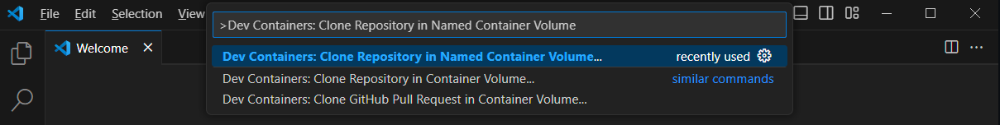
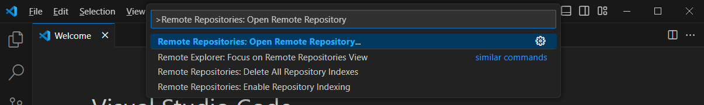

# MCC - Arches Project adaptation

Espace Développement as Code - projet MCC

Pour travailler avec ce repo assurez-vous que votre poste de travail répond au [Démariage développeur](./doc/demariage-developpeur.md).
A partir de la page d' accueil du repo cliquez sur un des boutons suivants pour ouvrir le projet dans un *[Dev Container](https://code.visualstudio.com/docs/devcontainers/containers)* avec Visual Studio Code.

**NOTE IMPORTANTE:** Si vous démarrez avec cette code. Lisez la documentation [Démariage développeur](./doc/demariage-developpeur.md)

Pour commencer à coder utiliser le button suivant:

[](https://vscode.dev/redirect?url=vscode://ms-vscode-remote.remote-containers/cloneInVolume?url=https://github.com/arches-mcc/mcc-arches-tests)

Options alternatives avec Visual Studio Code:

- (Option 1) Command Palette ( Ctrl+Shift+P ) / Dev Containers: Clone Repository in Named Container Volume
  
- (Option 2) Command Palette ( Ctrl+Shift+P ) / Remote Repositories: Open Remote Repository
  

-----
🚀 This clones this repo and opens it in a Dev Container right away.

>[Button source - Github godatadriven](https://github.com/godatadriven/python-devcontainer-template/blob/main/README.md)
-----

## Conseils de développement

Consulter le guide [Astuces développeur](./doc/astuces-développeur.md)

## Dependence Arches avec le Dev Container

- Postgres + Géométrie et données spatiales
- Redis
- Elastic Search

## Configuration & Extensions Visual Studio Code avec le Dev Container

- Editor Config
- Code Spell Checker
  - French - Code Spell Checker
- Docker
- SQL Tools
- Python
- Node
- CodeTour
- Markdown
- Drawio
- Rest Client

## Structure du repo
```shell
└── 📁.devcontainer                               # VS Code Dev Container
    ...                                           # ToDo
└── 📁dev                                         # Outillage pour les développeurs
    └── 📁bin                                     # Helper scripts
└── 📁doc
    └── 📁_assets                                 # fichiers des ressources: png, jpg ...
📄 README.md
```
