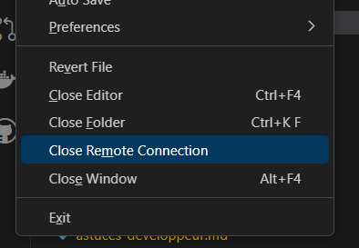
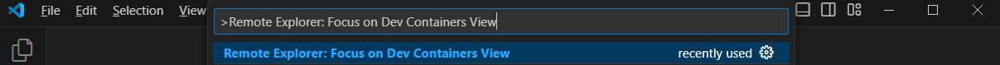
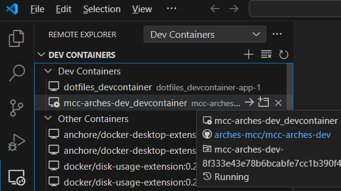
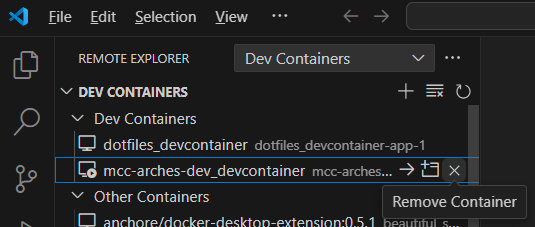

# Astuces Développeur

- [Astuces Développeur](#astuces-développeur)
  - [Comment nettoyer un conteneur de développement et recommencer (mcc-arches-dev)](#comment-nettoyer-un-conteneur-de-développement-et-recommencer-mcc-arches-dev)

## Comment nettoyer un conteneur de développement et recommencer (mcc-arches-dev)

Pour plus de simplicité, nous utiliserons notre projet Github **mcc-arches-dev**.

1. Assurez-vous que vous n'utilisez pas le conteneur de développement **mcc-arches-dev**. Si vous travaillez toujours avec vous pouvez le fermer depuis le menu : **File / Close Remote Connection**
   - 
2. Command Palette ( Ctrl+Shift+P ) / Remote Explorer: Focus on Dev Containers View
   - 
3. **Dev Containers View**
   - 
4. **Remove Container** et suivez les instructions
   - 
