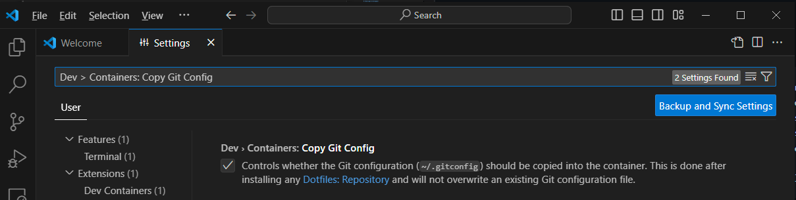

# Démariage développeur

- [Démariage développeur](#démariage-développeur)
  - [Pre-requis pour les développeurs](#pre-requis-pour-les-développeurs)
    - [Config minimal Windows](#config-minimal-windows)
    - [Outils minimal d'utilisation](#outils-minimal-dutilisation)

## Pre-requis pour les développeurs

### Config minimal Windows

ToDo ...
Windows Mode développeur, afficher l'extension du fichier, afficher les dossiers cachés
Dépannage WSL, Virtualisation

### Outils minimal d'utilisation

1. Outils de développement
   - [Git](https://git-scm.com/download/win)
   - [Rancher Desktop](https://github.com/rancher-sandbox/rancher-desktop/releases) ou Docker Desktop
   - [Visual Studio Code](https://code.visualstudio.com/)
2. Configuration - Git
   Configurer git. Au minimum pour travailler avec Github - **user.email**, **user.name**. [Où est mon email de configuration](https://github.com/settings/emails#:~:text=%40users.noreply.github.com,-.)
   ```bash
   git config --global user.email numb+id-github@users.noreplay.github.com
   git config --global user.name mon-nom-github

   git global --global -l
   ```
3. Configuration - Rancher Desktop
    - Container Engine = **Moby**
    - Kubernetes = **désactivé** *(pour des résonne de optimisation des ressources)*
  
4. Configuration - Visual Studio Code
    - Extensions
      - Editor Config
      - Docker
      - Kubernetes
      - Remote Development
      - Remote Repositories
      - Github Codespaces
      - Markdown All In One
      ```bash
      code.cmd --install-extension EditorConfig.EditorConfig
      code.cmd --install-extension ms-azuretools.vscode-docker
      code.cmd --install-extension ms-kubernetes-tools.vscode-kubernetes-tools
      code.cmd --install-extension ms-vscode-remote.vscode-remote-extensionpack
      code.cmd --install-extension ms-vscode.remote-repositories
      code.cmd --install-extension github.codespaces
      code.cmd --install-extension yzhang.markdown-all-in-one
      ```
    - Configuration
      - Désactiver - Dev > Containers: Forward WSLServices ("dev.containers.forwardWSLServices": false)
        
      - Activer - Dev > Containers: Copy Git Config ("dev.containers.copyGitConfig": true)
        
      - (Optionnel - en titre d'example example - personalisation développeur) Dotfiles: Repository ("dotfiles.repository": "https://github.com/pit-hub/dotfiles")
        
